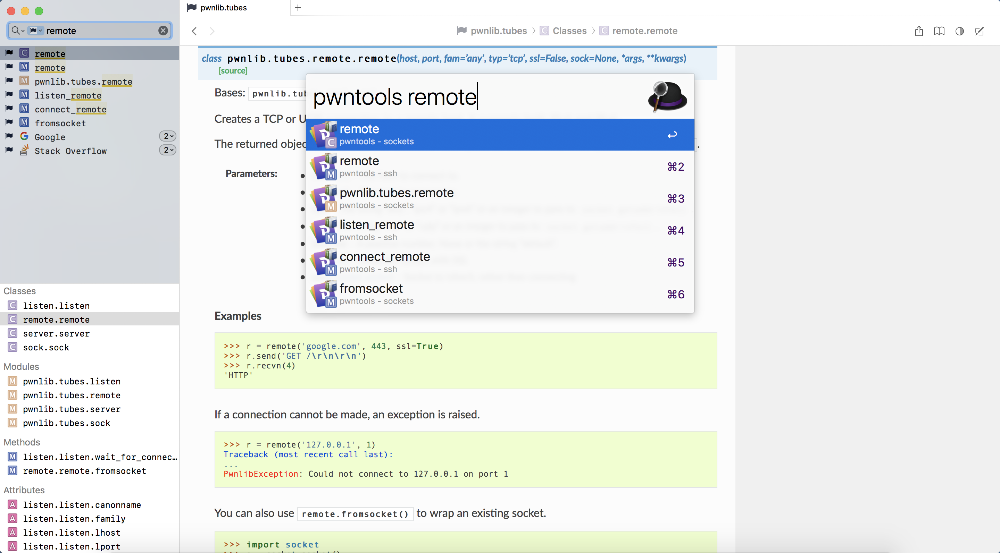
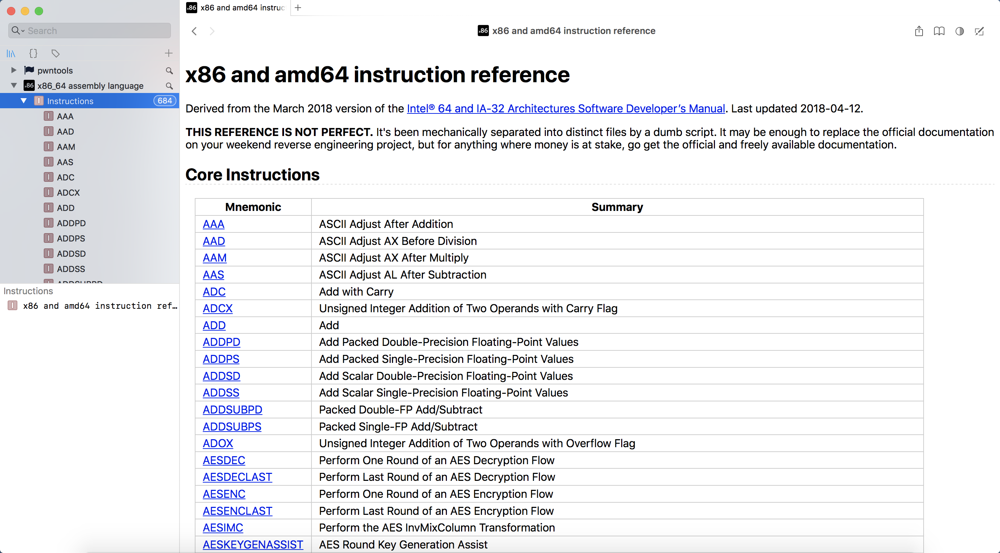
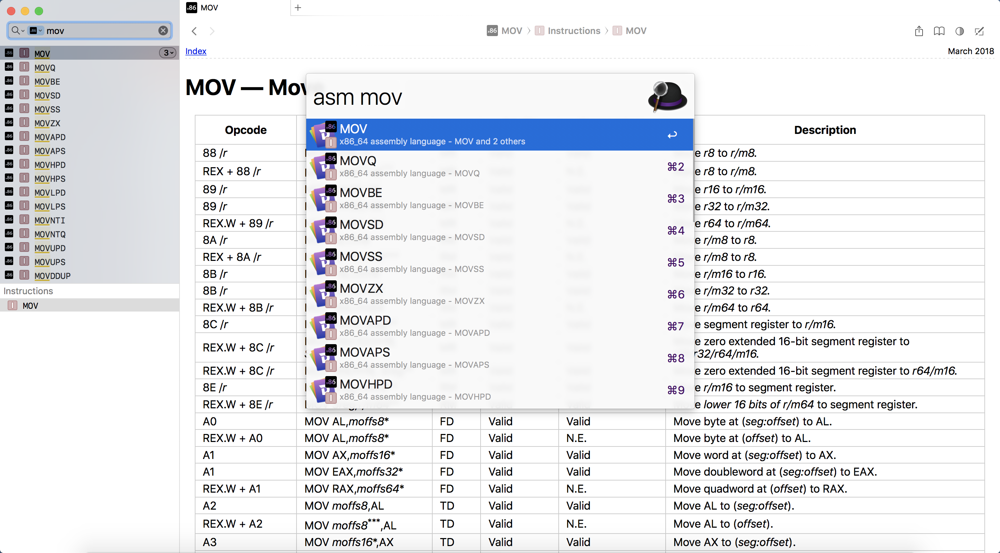

# pwn-dash-docset

**pwntools** and **x86_64 assembly language** dash docset.

Help you happy pwning and reversing.

## Screenshot

### pwntools

## 

### x86_64 assembly language

## How to Build

See the script.

[build pwntools](./pwntools/build.sh)

[build x86_64_asm](./x86_64_asm/build.sh)

## Thanks

https://github.com/Gallopsled/pwntools

https://github.com/technosophos/dashing

http://www.felixcloutier.com/x86/